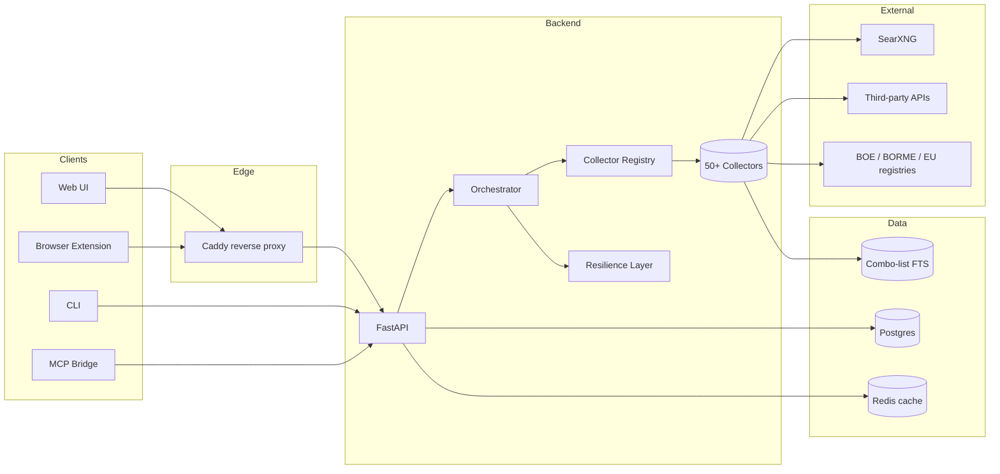

# Architecture

## High-level diagram

## Module breakdown

| Module | Path | Responsibility |
|---|---|---|
| **API** | `backend/app/api/` | FastAPI routers: cases, findings, exports, admin. |
| **Orchestrator** | `backend/app/orchestrator/` | Picks applicable collectors, fans them out, persists findings. |
| **Collectors** | `backend/app/collectors/` | One file per data source; subclasses of `Collector`. |
| **Resilience** | `backend/app/collectors/resilience.py` | Per-collector timeouts, retries, and circuit breakers. |
| **Schemas** | `backend/app/schemas.py` | `SearchInput`, `Finding`, case DTOs. |
| **GDPR** | `backend/app/gdpr/` | Retention, erasure, and audit log helpers. |
| **Web UI** | `extension/` and frontend assets | Operator surface served behind Caddy. |
| **Edge** | `caddy/` | Reverse proxy, TLS, basic auth. |
| **MCP bridge** | `mcp/` | Exposes the API as an MCP server. |
| **CLI** | `cli/` | Headless investigator workflows. |
| **SearXNG** | `searxng/` | Self-hosted meta-search backing dork collectors. |
| **Ops** | `ops/`, `scripts/` | Compose files, migrations, smoke tests. |
| **E2E** | `e2e/` | Playwright tests against a running stack. |

## Request lifecycle

1. Operator submits a `SearchInput` via UI/CLI/MCP.
2. API persists a `Case`, then hands the input to the orchestrator.
3. Orchestrator asks the registry for `applicable_for(input)` collectors.
4. Each collector runs through `run_with_resilience` (timeout + retries + breaker).
5. `Finding` rows are deduplicated by fingerprint and streamed back to the client.
6. Failures are stored as per-collector status rows — the case never aborts.
